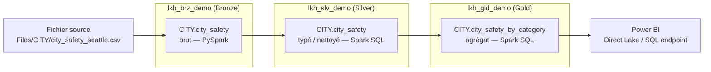
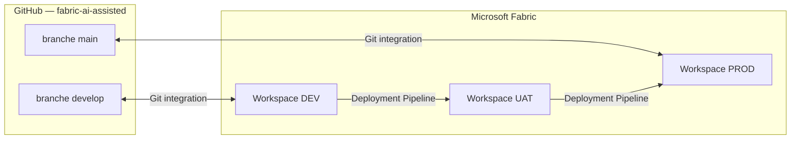
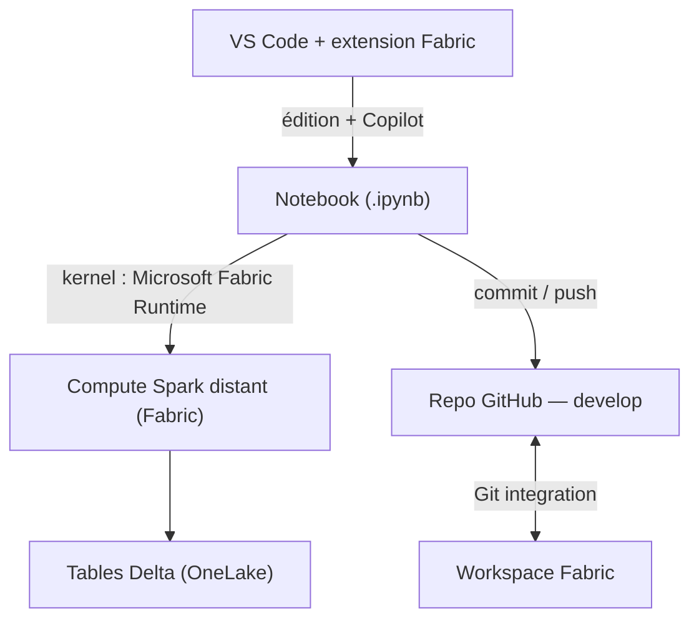
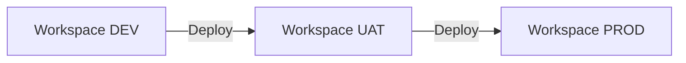

# Mode opératoire — Développement assisté Microsoft Fabric dans VS Code

> **Notebook · Lakehouse/Warehouse · GitHub Copilot · GitHub · Exécution distante · CI/CD**

| | |
|---|---|
| **Auteur** | Mathieu Savouré — Expertime |
| **Public** | Équipe Data / Fabric (procédure à reproduire) |
| **Statut** | v1 — opérationnel pour les étapes 1 à 6 ; CI/CD (étape 7) à compléter |
| **Environnement de référence** | Workspace `ws_assisted_dev`, repo GitHub `fabric-ai-assisted` (branche `develop`) |
| **Validé sur** | Capacité Fabric Expertime (F2), 3 Lakehouses schema-enabled |

---

## Sommaire

1. [Objectif & périmètre](#1-objectif--périmètre)
2. [Prérequis & installation](#2-prérequis--installation)
3. [Architecture cible](#3-architecture-cible)
4. [Préparer l'espace de travail local (clone Git)](#4-préparer-lespace-de-travail-local-clone-git)
5. [Ouvrir / créer un notebook dans VS Code](#5-ouvrir--créer-un-notebook-dans-vs-code)
6. [Se connecter aux données (Lakehouse / Warehouse)](#6-se-connecter-aux-données-lakehouse--warehouse)
7. [Support GitHub Copilot (agent FabricNotebook)](#7-support-github-copilot-agent-fabricnotebook)
8. [Exécuter le notebook sur le compute Fabric distant](#8-exécuter-le-notebook-sur-le-compute-fabric-distant)
9. [Exemple complet : pipeline médaillon City Safety](#9-exemple-complet--pipeline-médaillon-city-safety)
10. [Publier sur GitHub & synchroniser avec le workspace](#10-publier-sur-github--synchroniser-avec-le-workspace)
11. [CI/CD : déploiement DEV → UAT → PROD (à compléter)](#11-cicd--déploiement-dev--uat--prod-à-compléter)
12. [Limites & contraintes connues](#12-limites--contraintes-connues)
13. [Check-list de reprise de session](#13-check-list-de-reprise-de-session)
14. [Bonnes pratiques (synthèse)](#14-bonnes-pratiques-synthèse)
15. [Annexes](#15-annexes)

> **Convention captures d'écran** : les visuels sont référencés dans un dossier `images/` à côté de ce fichier (`images/NN-description.png`). Remplacez les emplacements `` par vos propres captures.

---

## 1. Objectif & périmètre

Poser les bonnes pratiques pour le scénario de travail suivant, **de bout en bout** :

- développer un **notebook dans VS Code** ;
- se connecter à des données **Lakehouse ou Warehouse** ;
- s'appuyer sur **GitHub Copilot** pour la génération de code ;
- **publier** le notebook sur un repo **GitHub** ;
- **synchroniser** le repo avec le **workspace Fabric** ;
- **exécuter** le notebook localement (dans VS Code) sur un **compute distant Fabric** ;
- **déployer** le notebook d'un workspace à l'autre (**CI/CD DEV → PROD**).

**Couverture de cette v1 :** étapes 1 à 6 **opérationnelles et validées** ; le CI/CD (étape 7) est documenté en **recommandation** (Deployment Pipelines Fabric) et reste **à valider en session dédiée**.

**État actuel vs cible :** on démarre dans **un seul workspace** (`ws_assisted_dev`). La cible est une séparation **DEV / UAT / PROD** (voir §3 et §11).

---

## 2. Prérequis & installation

### 2.1 Outils sur le poste

| Outil | Rôle | Note |
|---|---|---|
| **VS Code** | IDE | À jour |
| **Extension « Fabric Data Engineering »** (ex-Synapse) | Notebooks Fabric, connexion workspace, exécution distante | Éditeur Microsoft |
| **Extension GitHub Copilot** + **Copilot Chat** | Génération de code, agent `FabricNotebook` | Compte Copilot actif |
| **Git for Windows** | Versioning | `git --version` pour vérifier |
| **(Optionnel) Extension MSSQL** | Interroger un Warehouse / SQL endpoint | Pour la partie Warehouse |

### 2.2 Côté Fabric

- **Accès** : être au moins **Contributor** sur le workspace cible.
- **Capacité** : une capacité Fabric active (F2 minimum ; F2 suffit pour la démo mais voir §12 sur les temps de démarrage).
- **Lakehouses schema-enabled** : pour utiliser des schémas (`CITY`, `dbo`, …). Depuis fin 2025, les Lakehouses sont schema-enabled par défaut à la création.

### 2.3 Authentification (à refaire après expiration de session — voir §13)

1. **Fabric** : `Ctrl+Shift+P` → **`Fabric Data Engineering: Sign In`**.
2. **GitHub** : icône **Comptes** (bas-gauche de VS Code) → **Sign in with GitHub**.

> 

---

## 3. Architecture cible

### 3.1 Principe médaillon retenu

- **Lakehouse = couche** (Bronze / Silver / Gold) → `lkh_brz_demo`, `lkh_slv_demo`, `lkh_gld_demo`.
- **Schéma = domaine fonctionnel** → ex. `CITY`.
- **Idempotence** : `CREATE SCHEMA IF NOT EXISTS` + `CREATE OR REPLACE TABLE` pour pouvoir rejouer sans erreur.



### 3.2 Environnements (cible)

État actuel : **un seul workspace** de démarrage. Cible : **DEV / UAT / PROD**, chacun relié à sa branche, promotion via **Deployment Pipelines** (§11).



### 3.3 Vue d'ensemble du workflow de dev



---

## 4. Préparer l'espace de travail local (clone Git)

> À faire **une fois** par poste. PowerShell sous Windows.

```powershell
cd C:\Users\<user>\repos        # créer le dossier si besoin : mkdir repos
git clone https://github.com/<org>/fabric-ai-assisted.git
cd fabric-ai-assisted
git checkout develop
git pull
git branch                      # doit afficher : * develop
```

> ⚠️ **Ne pas cloner dans un dossier synchronisé OneDrive** (conflits avec le dossier `.git`). Préférer `C:\Users\<user>\repos`.

### 4.1 `.gitignore` (exclure le cache de l'extension)

L'extension Fabric génère des dossiers techniques à **ne pas** committer :

```gitignore
.stubs/
.vfscache/
.vfsmeta/
.work-folder-info
# dossier(s) d'item téléchargé (GUID) si vous passez par l'extension
```

### 4.2 Pointer l'extension sur le dossier local

Dans la vue **Fabric Data Engineering** :

1. **Set Local Work Folder** → sélectionner le dossier du clone (`…\fabric-ai-assisted`).
2. **Select Workspace** → choisir le workspace (ex. `ws_assisted_dev`).

> 

---

## 5. Ouvrir / créer un notebook dans VS Code

### 5.1 Deux modes d'accès (à connaître)

| Mode | Description | Sauvegarde |
|---|---|---|
| **VFS (Remote)** | Navigation directe dans le workspace distant (« FABRIC WORKSPACES [REMOTE] »). | `Ctrl+S` écrit **vers Fabric**, *pas* dans le clone Git. |
| **Local** | Items téléchargés dans le work folder local (« WORKSPACES [FABRIC DATA ENGINEERING] »). | Sur disque local → exploitable par Git. |

> 🔎 **Conséquence importante** : pour versionner dans Git, il faut **matérialiser le notebook en local** (mode Local + Download, ou `Save As` vers le repo). Voir §10.

### 5.2 Ouvrir en vue notebook

- Cliquer sur l'item **Notebook** (pas le dossier, pas `Item definition`).
- S'il s'ouvre en `.py` brut : clic droit → **Open in Synapse VS Code**, ou `Ctrl+Shift+P` → **View: Reopen Editor With… → Jupyter Notebook**.
- Sélectionner le kernel **« Microsoft Fabric Runtime »** (haut-droite).

> 

> 💡 Le notebook Fabric est stocké nativement sous forme **`notebook-content.py`** (sérialisation Fabric) — c'est normal, ce n'est pas un bug.

---

## 6. Se connecter aux données (Lakehouse / Warehouse)

### 6.1 Lakehouse — préparation

1. **Déposer le fichier source** (le upload de fichier vers `Files/` se fait **dans le portail** Fabric : Lakehouse → **Files** → **Upload**).
2. **Lakehouse par défaut** : dans le notebook, panneau **Lakehouses** → **Add** → choisir le Lakehouse → **épingler par défaut**. C'est ce qui rend valides les **chemins relatifs** (`Files/…`) et les **noms de table courts** (`schema.table`).
3. **Attacher les Lakehouses cibles** : pour écrire dans plusieurs Lakehouses (Bronze/Silver/Gold), **attacher les 3** au notebook (panneau Lakehouses).

> 

### 6.2 Point clé validé — écriture cross-Lakehouse en **Spark SQL pur**

C'est le point technique central de ce mode opératoire :

- ✅ **Lecture** cross-Lakehouse en SQL pur : le **nommage 4 parties** `workspace.lakehouse.schema.table` fonctionne pour référencer/joindre des tables de plusieurs Lakehouses.
- ✅ **Écriture** vers un Lakehouse **non-défaut** en SQL pur : `CREATE OR REPLACE TABLE workspace.lakehouse.schema.table AS SELECT …` **fonctionne**, **à condition d'avoir attaché les Lakehouses** (et un Lakehouse par défaut schema-enabled). **Aucun chemin ABFSS nécessaire.**
- ⚠️ **Limite** : `saveAsTable("autre_lakehouse.schema.table")` **échoue** (Spark interprète le 1er segment comme un schéma du Lakehouse **par défaut**, d'où l'erreur `Couldn't find a catalog to handle the identifier`). → Pour écrire ailleurs que le défaut, utiliser le **4-part naming en SQL** (ou, à défaut, un chemin ABFSS `.save()`).

> **Recommandation** : ingestion du fichier en **PySpark**, transformations **Silver/Gold en `%%sql` (4-part naming)**, **les Lakehouses attachés**.

### 6.3 Warehouse (variante)

- Un Warehouse (ou le **SQL analytics endpoint** d'un Lakehouse) s'interroge via l'**extension MSSQL** / la chaîne de connexion du **SQL endpoint**.
- Usage typique : requêtes T-SQL de contrôle / exposition. Pour le pipeline médaillon, on reste côté **Spark (notebook)**.

> *Section à enrichir si l'équipe industrialise des traitements Warehouse.*

---

## 7. Support GitHub Copilot (agent FabricNotebook)

### 7.1 Activer l'agent

1. Ouvrir **Copilot Chat** : `Ctrl+Alt+I` (ou **View → Chat**).
2. En bas du panneau, sélecteur d'agent → choisir **FabricNotebook** (mode **Local**). Cet agent est *Fabric-aware* (il connaît `spark`, les chemins Lakehouse, le 4-part naming).

> 

### 7.2 Outils MCP Fabric (lecture seule)

L'agent peut appeler des outils MCP (`get_fabric_doc`, `query_code_examples`) pour aligner sa génération sur la doc officielle. Ils sont en **lecture seule** → **Allow in this Session**.

> 🔐 **Vigilance** : autoriser **au cas par cas**. Lire le **nom de l'outil** avant d'accepter — refuser un outil qui voudrait **écrire / exécuter / supprimer** s'il n'est pas attendu.

### 7.3 Prompt cadré (recommandé)

Un bon prompt **donne les contraintes** (sinon Copilot peut générer du `saveAsTable` cross-Lakehouse qui échoue). Modèle prêt à l'emploi en **[Annexe A](#annexe-a--prompt-copilot-type)**.

### 7.4 Discipline « l'IA propose, l'équipe valide » (règle des 4D)

- Copilot **propose** des cellules (workflow **Keep / Undo** dans l'éditeur) → cliquer **Keep** pour figer.
- **Relire systématiquement** avant d'exécuter, en priorité :
  - les écritures Silver/Gold = bien du **4-part naming** (`ws.lakehouse.schema.table`), pas du `saveAsTable` cross-Lakehouse ;
  - la **casse** du schéma (`CITY` ≠ `city`, OneLake est sensible à la casse).

---

## 8. Exécuter le notebook sur le compute Fabric distant

Le notebook est **édité dans VS Code** mais **s'exécute sur le Spark distant Fabric** via le kernel **Microsoft Fabric Runtime**.

1. **Connect** (haut du notebook) → **Microsoft Fabric Runtime**.
2. Choix du type de session :
   - **New standard session** : session Spark dédiée (recommandé en solo).
   - **New high concurrency session** : pool partagé entre notebooks (utile à plusieurs / petite capacité).
3. Attendre le démarrage (cf. §12 : *cold start* possible sur petite capacité).
4. Exécuter les cellules (`Shift+Entrée` / **Run All**).

> 

---

## 9. Exemple complet : pipeline médaillon City Safety

Dataset de démo : *Seattle City Safety* (CSV, 11 colonnes d'entête). Résultats validés : **Bronze 7350 → Silver 7350 → Gold 2028**.

### 9.1 Bronze — PySpark (Lakehouse par défaut)

```python
# Création du schéma CITY dans le Lakehouse par défaut (lkh_brz_demo)
spark.sql("CREATE SCHEMA IF NOT EXISTS CITY")

# Lecture du CSV brut
df_brz = (spark.read
          .option("header", "true")
          .option("inferSchema", "true")
          .csv("Files/CITY/city_safety_seattle.csv"))

# Écriture idempotente en Bronze
(df_brz.write
   .mode("overwrite")
   .option("overwriteSchema", "true")
   .saveAsTable("CITY.city_safety"))

print("Bronze CITY.city_safety :", spark.read.table("CITY.city_safety").count(), "lignes")
```

### 9.2 Silver — Spark SQL pur (4-part naming, Lakehouse non-défaut)

```python
%%sql
CREATE SCHEMA IF NOT EXISTS ws_assisted_dev.lkh_slv_demo.CITY;

CREATE OR REPLACE TABLE ws_assisted_dev.lkh_slv_demo.CITY.city_safety AS
SELECT
  dataType,
  dataSubtype,
  to_timestamp(dateTime, 'yyyy-MM-dd HH:mm:ss')        AS event_datetime,
  year(to_timestamp(dateTime, 'yyyy-MM-dd HH:mm:ss'))  AS event_year,
  month(to_timestamp(dateTime, 'yyyy-MM-dd HH:mm:ss')) AS event_month,
  category,
  NULLIF(TRIM(subcategory), 'NULL') AS subcategory,
  NULLIF(TRIM(status), 'NULL')      AS status,
  address,
  CAST(latitude  AS double) AS latitude,
  CAST(longitude AS double) AS longitude,
  NULLIF(TRIM(source), 'NULL')      AS source,
  current_timestamp()         AS Sid_LoadTimestamp,
  'city_safety_seattle.csv'   AS Sid_SourceFile
FROM CITY.city_safety;

SELECT COUNT(*) AS silver_row_count
FROM ws_assisted_dev.lkh_slv_demo.CITY.city_safety;
```

> Transformations Silver : remise en `NULL` réel des `"NULL"` texte, typage des dates, dérivations année/mois, cast géo, colonnes techniques `Sid_*` (convention REX).

### 9.3 Gold — Spark SQL pur (agrégat prêt Power BI)

```python
%%sql
CREATE SCHEMA IF NOT EXISTS ws_assisted_dev.lkh_gld_demo.CITY;

CREATE OR REPLACE TABLE ws_assisted_dev.lkh_gld_demo.CITY.city_safety_by_category AS
SELECT
  dataSubtype,
  category,
  event_year,
  event_month,
  COUNT(*) AS nb_incidents
FROM ws_assisted_dev.lkh_slv_demo.CITY.city_safety
GROUP BY dataSubtype, category, event_year, event_month;

SELECT COUNT(*) AS gold_row_count
FROM ws_assisted_dev.lkh_gld_demo.CITY.city_safety_by_category;
```

### 9.4 Contrôles

- Rafraîchir **Tables** dans chaque Lakehouse → vérifier la présence du schéma `CITY` et des tables.
- La table Gold est branchable dans **Power BI** (Direct Lake sur le SQL endpoint de `lkh_gld_demo`).

> 

---

## 10. Publier sur GitHub & synchroniser avec le workspace

Deux voies. **La voie A (Git integration Fabric) est recommandée** pour un repo lisible et le CI/CD.

### 10.1 Avant tout commit

1. **Clear All Outputs** (barre du notebook) → diff propres, pas de données dans Git.
2. **`Ctrl+S`** (le point sur l'onglet doit disparaître).

### 10.2 Voie A — Git integration Fabric (recommandée)

Le workspace est relié au repo/branche → on commit **depuis le portail** :

1. Portail Fabric → workspace → **Source control**.
2. (Première fois) **Add account** : *Display name*, **PAT GitHub** (permission **Contents: Read & write** sur le repo), **Repository URL**.
3. Cocher les items modifiés (ex. `nb_city_safety`) → message → **Commit** sur `develop`.

> Avantage : items rangés **lisiblement** (dossier `fabric/`), structure exploitable par les Deployment Pipelines.
> Pré-requis : le compte GitHub doit avoir l'**accès en écriture** au repo.

> 

### 10.3 Voie B — Depuis VS Code (Git CLI)

Fonctionne, mais il faut d'abord **matérialiser le notebook sur disque** (voir §5.1) :

- soit via l'extension : clic droit sur l'item → **Download Item Definition…** vers le repo ;
- soit, si la session est expirée (download bloqué), via **File → Save As…** vers le repo en `.ipynb` (saisir l'extension `.ipynb`, et **un chemin local `C:\…`**, pas `/Workspaces/…`).

Puis :

```powershell
cd C:\Users\<user>\repos\fabric-ai-assisted
git add <chemin-du-notebook>          # cibler le fichier, éviter "git add ." (cache extension)
git commit -m "feat(<domaine>): <description>"
git push
```

### 10.4 Promotion `develop → main`

La promotion vers `main` se fait par **Pull Request GitHub**, **revue et mergée par un référent** (discipline de validation). Tant qu'aucune PR n'est créée, le travail **reste sur `develop`** (sauvegardé, non promu).

---

## 11. CI/CD : déploiement DEV → UAT → PROD (à compléter)

> 🟠 **Section en recommandation — à valider en session dédiée.** Non exécutée de bout en bout à ce stade.

**Approche retenue : Deployment Pipelines Fabric** (déploiement natif inter-workspaces, sans GitHub Actions).

### 11.1 Mise en place cible

1. Créer **3 workspaces** : `…_DEV`, `…_UAT`, `…_PROD` (état actuel : mono-workspace de démarrage).
2. Créer un **Deployment Pipeline** à 3 étapes et **assigner** un workspace par étage (DEV / UAT / PROD).
3. Déployer DEV → UAT → PROD via le pipeline (comparaison + sélection des items à promouvoir).



### 11.2 Paramétrage à prévoir (éviter les valeurs en dur)

- **Règles de déploiement** (deployment rules) : ex. **default lakehouse** différent par étage, pour que le notebook pointe le bon Lakehouse en UAT/PROD.
- **Variable Libraries** : externaliser les identifiants/paramètres d'environnement pour ne pas figer d'IDs dans le code.
- Cohérence avec la **Git integration** : DEV ↔ `develop`, PROD ↔ `main` (cf. §3.2).

### 11.3 À compléter

- [ ] Création effective des workspaces DEV/UAT/PROD.
- [ ] Création du Deployment Pipeline + assignation.
- [ ] Définition des deployment rules (default lakehouse par étage).
- [ ] Mise en place des Variable Libraries.
- [ ] Test d'un cycle complet de promotion + procédure de rollback.

---

## 12. Limites & contraintes connues

> À connaître **avant** de démarrer, pour ne pas se faire surprendre.

| Limite / contrainte | Impact | Contournement |
|---|---|---|
| **Items non créables / non déplaçables dans les dossiers de workspace depuis VS Code** | Impossible de ranger un notebook dans un sous-dossier via l'arbre VS Code | Gérer l'organisation **dans le portail** (Move to / New folder), puis **Refresh** dans VS Code |
| **`saveAsTable` vers un Lakehouse non-défaut échoue** | Erreur `Couldn't find a catalog…` | **4-part naming en Spark SQL** (`CREATE OR REPLACE TABLE ws.lakehouse.schema.table …`) avec Lakehouses **attachés** |
| **`Ctrl+S` en mode VFS sauvegarde vers Fabric, pas vers Git** | Le code peut ne pas être dans le clone local | Mode **Local + Download**, ou **Save As** vers le repo, ou **Git integration** côté portail |
| **Sessions / tokens qui expirent** | Appels API (ex. download de notebook) en `401` après une longue session | **Sign In** à nouveau ; en dépannage **Developer: Reload Window** ; purge éventuelle du cache VFS |
| **Items téléchargés sous un dossier GUID (via extension)** | Repo moins lisible pour le CI/CD | Privilégier la **Git integration Fabric** (dossier `fabric/`, noms lisibles) |
| **Casse du nom de schéma (OneLake sensible à la casse)** | `CITY` ≠ `city` → risque de **doublons de schémas** | Fixer une **convention de casse** et s'y tenir (ici `CITY`) |
| **Lakehouse par défaut doit être schema-enabled** | Sinon les schémas ne sont pas accessibles | Garder un **Lakehouse schema-enabled** épinglé (ou aucun) |
| **Démarrage Spark sur petite capacité (F2)** | *Cold start* de quelques minutes, quotas de sessions concurrentes | Anticiper le délai ; **high concurrency** si plusieurs notebooks ; coordonner les exécutions ; monter la capacité si besoin |
| **Upload de fichier vers `Files/` non disponible depuis VS Code** | — | Faire l'upload **dans le portail** |

---

## 13. Check-list de reprise de session

> Le lendemain, la session Spark et les variables en mémoire sont perdues (les **données** Delta et le CSV, eux, **persistent**).

1. **Sign In** Fabric (`Ctrl+Shift+P` → `Fabric Data Engineering: Sign In`).
2. **Synchroniser Git** :
   ```powershell
   cd C:\Users\<user>\repos\fabric-ai-assisted
   git checkout develop
   git pull
   ```
3. Ouvrir le notebook → kernel **Microsoft Fabric Runtime** → **nouvelle session**.
4. **Ré-attacher** les Lakehouses + épingler le Lakehouse par défaut.
5. **Cellule de contrôle** :
   ```python
   import notebookutils
   display(notebookutils.fs.ls("Files/CITY"))   # le fichier source est-il là ?
   spark.sql("SHOW SCHEMAS").show()              # le schéma attendu existe ?
   spark.sql("SHOW TABLES IN CITY").show()       # tables déjà présentes ?
   ```
6. Relancer les cellules nécessaires (la lecture du fichier doit être ré-exécutée).

---

## 14. Bonnes pratiques (synthèse)

- 🔒 **Committer en fin de chaque session** (sinon, risque de repartir d'un notebook vide le lendemain).
- 🤝 **« L'IA propose, l'équipe valide »** : relire le code Copilot, surtout les écritures cross-Lakehouse.
- 🧱 **Lakehouse = couche, schéma = domaine** (convention claire et homogène).
- ♻️ **Idempotence** : `CREATE SCHEMA IF NOT EXISTS` + `CREATE OR REPLACE TABLE`.
- 🧭 **Éviter les valeurs en dur** : chemins relatifs, et **Variable Libraries** pour le multi-environnement.
- 🧹 **Clear All Outputs** avant commit (diffs propres, pas de données dans Git).
- 🌿 **`develop` pour travailler, `main` pour le stable** ; promotion par PR revue.
- 📄 **Git integration Fabric** privilégiée à la voie GUID pour un repo lisible.

---

## 15. Annexes

### Annexe A — Prompt Copilot type

```text
Contexte : notebook Fabric, 3 Lakehouses ATTACHÉS dans ws_assisted_dev, schema-enabled :
lkh_brz_demo (par défaut/pinned), lkh_slv_demo, lkh_gld_demo. CSV présent :
Files/CITY/city_safety_seattle.csv. Schéma cible = CITY (majuscules).

Objectif : médaillon Bronze→Silver→Gold. Bronze en PySpark (lecture CSV),
Silver et Gold en Spark SQL pur avec nommage 4 parties (workspace.lakehouse.schema.table),
SANS chemins ABFSS.

Règles impératives :
- Toujours CREATE SCHEMA IF NOT EXISTS avant d'écrire, dans chaque Lakehouse concerné.
- Toujours CREATE OR REPLACE TABLE (idempotent), jamais CREATE TABLE simple.
- NE PAS utiliser saveAsTable avec un nom de Lakehouse non-défaut.

1. Bronze (PySpark) : CREATE SCHEMA IF NOT EXISTS CITY ; lecture CSV (header, inferSchema) ;
   saveAsTable("CITY.city_safety") ; print du count.
2. Silver (%%sql) : CREATE OR REPLACE TABLE ws_assisted_dev.lkh_slv_demo.CITY.city_safety AS SELECT …
   avec NULLIF(TRIM(col),'NULL'), to_timestamp(dateTime,'yyyy-MM-dd HH:mm:ss') + year/month,
   CAST géo en double, current_timestamp() AS Sid_LoadTimestamp, '…csv' AS Sid_SourceFile ;
   terminer par un SELECT COUNT(*).
3. Gold (%%sql) : CREATE OR REPLACE TABLE ws_assisted_dev.lkh_gld_demo.CITY.city_safety_by_category AS
   SELECT dataSubtype, category, event_year, event_month, COUNT(*) AS nb_incidents … GROUP BY … ;
   terminer par un SELECT COUNT(*).

Si une commande 4 parties échoue (« Couldn't find a catalog… » / « Artifact not found »),
ARRÊTE-TOI et signale-le (ne bascule pas en ABFSS sans validation).
```

### Annexe B — Commandes Git utiles

```powershell
git status                       # état (branche, fichiers non suivis)
git checkout develop ; git pull  # se mettre à jour sur develop
git add <fichier>                # stager un fichier précis
git commit -m "type(scope): msg" # convention de message
git push                         # pousser sur la branche courante
git log --oneline -1             # dernier commit

# Authentification (si push refusé en mot de passe) :
git config --global credential.helper manager
# puis se connecter via l'icône Comptes de VS Code (Sign in with GitHub),
# ou coller un PAT à la demande de "password".
```

### Annexe C — Glossaire

| Terme | Définition |
|---|---|
| **VFS** | *Virtual File System* de l'extension Fabric : vue distante du workspace dans VS Code. |
| **4-part naming** | `workspace.lakehouse.schema.table` — référence pleinement qualifiée d'une table. |
| **ABFSS** | Chemin de stockage OneLake (`abfss://…`). Non requis ici grâce au 4-part naming. |
| **Schema-enabled Lakehouse** | Lakehouse organisant ses tables par schémas (`dbo`, `CITY`, …). |
| **Microsoft Fabric Runtime** | Kernel VS Code exécutant les cellules sur le **Spark distant** Fabric. |
| **Deployment Pipeline** | Mécanisme Fabric de promotion d'items entre workspaces (DEV/UAT/PROD). |
| **Git integration (Fabric)** | Liaison workspace ↔ branche Git, commit/sync depuis le portail. |
| **Sid_** | Préfixe de colonnes techniques (timestamp de chargement, fichier source…). |

---

*Document de travail — à enrichir au fil des sessions (notamment §6.3 Warehouse et §11 CI/CD).*
