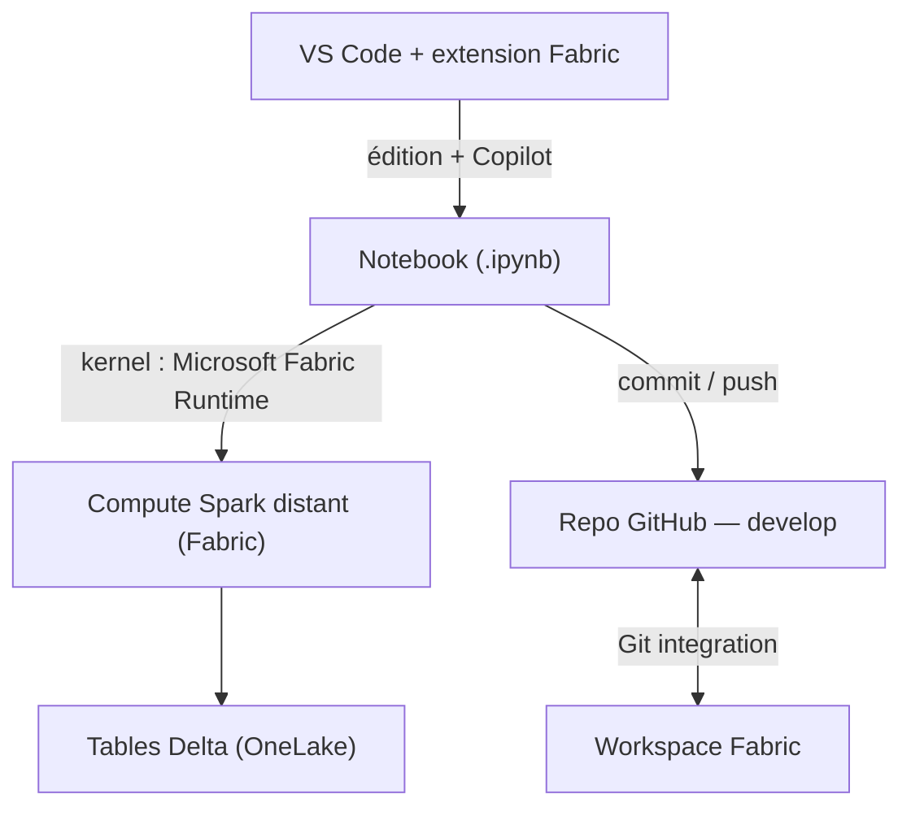

# fabric-ai-assisted

Développement **assisté** de pipelines Microsoft Fabric **depuis VS Code** : notebook édité localement, exécuté sur le **compute Spark distant Fabric**, données en **Lakehouse**, génération de code via **GitHub Copilot**, versioning **GitHub**.

> Ce README formalise **le processus de travail** (hors CI/CD).
> Le détail complet — y compris le **CI/CD (Deployment Pipelines)** — est dans [`Mode_operatoire_Fabric_VSCode_Copilot_GitHub.md`](./Mode_operatoire_Fabric_VSCode_Copilot_GitHub.md).

---

## Sommaire

- [Prérequis](#prérequis)
- [Le processus en bref](#le-processus-en-bref)
- [Étapes détaillées](#étapes-détaillées)
- [Conventions de code](#conventions-de-code)
- [⚠️ Limites & contraintes connues](#️-limites--contraintes-connues)
- [Reprise de session (check-list)](#reprise-de-session-check-list)
- [Bonnes pratiques](#bonnes-pratiques)
- [Structure du repo](#structure-du-repo)

---

## Prérequis

| Élément | Détail |
|---|---|
| **VS Code** | + extension **Fabric Data Engineering** (ex-Synapse) |
| **GitHub Copilot** | extension + **Copilot Chat** (agent `FabricNotebook`) |
| **Git for Windows** | `git --version` pour vérifier |
| **Accès Fabric** | au moins **Contributor** sur le workspace + une **capacité** active (F2 min.) |
| **Lakehouses** | **schema-enabled** (par défaut depuis fin 2025) |

**Connexions à (re)faire après expiration de session :**
- Fabric : `Ctrl+Shift+P` → **`Fabric Data Engineering: Sign In`**
- GitHub : icône **Comptes** (bas-gauche VS Code) → **Sign in with GitHub**

---

## Le processus en bref



> Le notebook est **édité dans VS Code** mais **s'exécute sur le Spark distant Fabric** (kernel *Microsoft Fabric Runtime*). Les **données** vivent dans OneLake (Lakehouse), le **code** est versionné dans GitHub.

---

## Étapes détaillées

### 1. Préparer l'espace de travail local (une fois)

```powershell
cd C:\Users\<user>\repos
git clone https://github.com/<org>/fabric-ai-assisted.git
cd fabric-ai-assisted
git checkout develop
git pull
```

> ⚠️ Ne pas cloner dans un dossier **OneDrive** (conflits avec `.git`).

Dans la vue **Fabric Data Engineering** : **Set Local Work Folder** → le clone, puis **Select Workspace**.

### 2. Ouvrir le notebook

- Cliquer sur l'item **Notebook** → vue cellules.
- S'il s'ouvre en `.py` brut : clic droit → **Open in Synapse VS Code**.
- Sélectionner le kernel **Microsoft Fabric Runtime**.

### 3. Se connecter aux données (Lakehouse)

1. **Upload du fichier source** : se fait **dans le portail** (Lakehouse → **Files** → **Upload**).
2. **Lakehouse par défaut** : panneau **Lakehouses** → **Add** → épingler par défaut (active les chemins relatifs `Files/…` et les noms de table courts).
3. **Attacher les Lakehouses cibles** (Bronze/Silver/Gold) au notebook pour l'écriture cross-Lakehouse.

### 4. Générer le code avec Copilot

- `Ctrl+Alt+I` → Copilot Chat → agent **FabricNotebook** (mode **Local**).
- Outils MCP Fabric (`get_fabric_doc`, `query_code_examples`) = lecture seule → **Allow in this Session** (au cas par cas).
- Utiliser un **prompt cadré** (voir mode opératoire, Annexe A) puis **Keep** les cellules.
- **Règle d'or — « l'IA propose, l'équipe valide »** : relire le code généré, surtout les écritures cross-Lakehouse (voir [Conventions](#conventions-de-code)).

### 5. Exécuter sur le compute distant

- **Connect** → **Microsoft Fabric Runtime** → **New standard session** (ou *high concurrency* à plusieurs).
- Lancer les cellules. *Cold start* possible sur petite capacité (voir [Limites](#️-limites--contraintes-connues)).

### 6. Publier sur GitHub & synchroniser

Avant tout commit : **Clear All Outputs** + **`Ctrl+S`**.

**Voie recommandée — Git integration Fabric** (repo lisible) :
Portail → workspace → **Source control** → *Add account* (PAT, Contents: R/W) → cocher les items → **Commit** sur `develop`.

**Voie VS Code (Git CLI)** — nécessite de **matérialiser le notebook sur disque** d'abord (Download Item Definition, ou *Save As* vers le repo en `.ipynb` avec un chemin **local `C:\…`**) :

```powershell
git add <chemin-du-notebook>
git commit -m "feat(<domaine>): <description>"
git push
```

> `develop` = branche de travail · `main` = branche stable (promotion par **Pull Request revue**).

---

## Conventions de code

- **Lakehouse = couche** (Bronze / Silver / Gold) · **Schéma = domaine** (ex. `CITY`).
- **Idempotence** : `CREATE SCHEMA IF NOT EXISTS` + `CREATE OR REPLACE TABLE`.
- **Ingestion fichier en PySpark**, **transformations Silver/Gold en Spark SQL** (`%%sql`).
- **Écriture cross-Lakehouse en SQL pur** via **nommage 4 parties** `workspace.lakehouse.schema.table`, **Lakehouses attachés** — pas besoin d'ABFSS :

```python
%%sql
CREATE SCHEMA IF NOT EXISTS ws_assisted_dev.lkh_slv_demo.CITY;

CREATE OR REPLACE TABLE ws_assisted_dev.lkh_slv_demo.CITY.city_safety AS
SELECT ... FROM CITY.city_safety;
```

> Exemple complet (Bronze→Silver→Gold) : voir [`fabric/nb_city_safety.ipynb`](./fabric/nb_city_safety.ipynb). Résultats de réf. : **Bronze 7350 → Silver 7350 → Gold 2028**.

---

## ⚠️ Limites & contraintes connues

> À lire **avant** de démarrer.

| Limite / contrainte | Impact | Contournement |
|---|---|---|
| **Items non créables / non déplaçables dans les dossiers de workspace depuis VS Code** | Un notebook ne peut pas être rangé dans un sous-dossier via l'arbre VS Code | Organiser **dans le portail** (Move to / New folder) puis **Refresh** dans VS Code |
| **`saveAsTable` vers un Lakehouse non-défaut échoue** | Erreur `Couldn't find a catalog to handle the identifier` | **4-part naming en Spark SQL** (`CREATE OR REPLACE TABLE ws.lakehouse.schema.table …`) avec Lakehouses **attachés** |
| **`Ctrl+S` en mode VFS sauvegarde vers Fabric, pas vers Git** | Le code peut ne pas être dans le clone local | Mode **Local + Download**, **Save As** local, ou **Git integration** portail |
| **Sessions / tokens qui expirent** | Appels API (ex. download notebook) en `401` après longue session | **Sign In** à nouveau ; en dépannage **Developer: Reload Window** ; purge du cache VFS si besoin |
| **Items téléchargés sous un dossier GUID (via extension)** | Repo moins lisible | Privilégier la **Git integration Fabric** (dossier `fabric/`, noms lisibles) |
| **Casse du nom de schéma (OneLake sensible à la casse)** | `CITY` ≠ `city` → doublons de schémas possibles | Fixer **une convention de casse** et s'y tenir |
| **Lakehouse par défaut doit être schema-enabled** | Sinon les schémas ne sont pas accessibles | Garder un Lakehouse **schema-enabled** épinglé (ou aucun) |
| **Démarrage Spark sur petite capacité (F2)** | *Cold start* de quelques minutes, quotas de sessions concurrentes | Anticiper le délai ; **high concurrency** à plusieurs ; coordonner les exécutions ; monter la capacité si besoin |
| **Upload de fichier vers `Files/` indisponible depuis VS Code** | — | Faire l'upload **dans le portail** |

---

## Reprise de session (check-list)

> La session Spark et les variables en mémoire sont perdues entre deux jours ; les **données** Delta et les fichiers, eux, **persistent**.

1. **Sign In** Fabric.
2. `git checkout develop && git pull`.
3. Ouvrir le notebook → kernel **Microsoft Fabric Runtime** → **nouvelle session**.
4. **Ré-attacher** les Lakehouses + épingler le défaut.
5. Cellule de contrôle :
   ```python
   import notebookutils
   display(notebookutils.fs.ls("Files/CITY"))   # fichier source présent ?
   spark.sql("SHOW SCHEMAS").show()              # schéma attendu présent ?
   spark.sql("SHOW TABLES IN CITY").show()       # tables déjà écrites ?
   ```

---

## Bonnes pratiques

- 🔒 **Committer en fin de chaque session** (sinon risque de notebook vide le lendemain).
- 🤝 **« L'IA propose, l'équipe valide »** : relire le code Copilot.
- 🧱 **Lakehouse = couche, schéma = domaine**.
- ♻️ **Idempotence** (`IF NOT EXISTS` / `CREATE OR REPLACE`).
- 🧭 **Pas de valeurs en dur** : chemins relatifs / paramètres externalisés.
- 🧹 **Clear All Outputs** avant commit.
- 🌿 **`develop`** pour travailler, **`main`** pour le stable (PR revue).

---

## Structure du repo

```
fabric-ai-assisted/
├── fabric/
│   └── nb_city_safety.ipynb     # pipeline médaillon de démo (Bronze→Silver→Gold)
├── .gitignore                   # ignore le cache de l'extension Fabric (.vfscache, .stubs, dossier GUID…)
├── README.md                    # ce fichier — le processus
└── Mode_operatoire_Fabric_VSCode_Copilot_GitHub.md   # manuel détaillé + CI/CD
```

**Branches** : `develop` (travail) · `main` (stable, promotion par PR).

---

*Pour le détail pas-à-pas, les schémas d'architecture, le prompt Copilot type et le CI/CD (Deployment Pipelines DEV→UAT→PROD), voir le [mode opératoire complet](./Mode_operatoire_Fabric_VSCode_Copilot_GitHub.md).*
